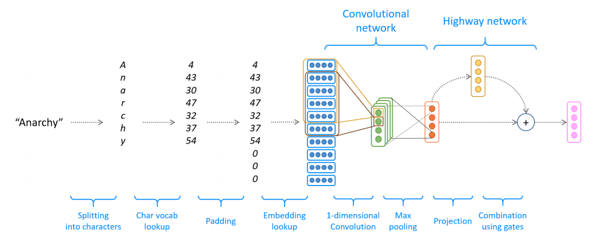
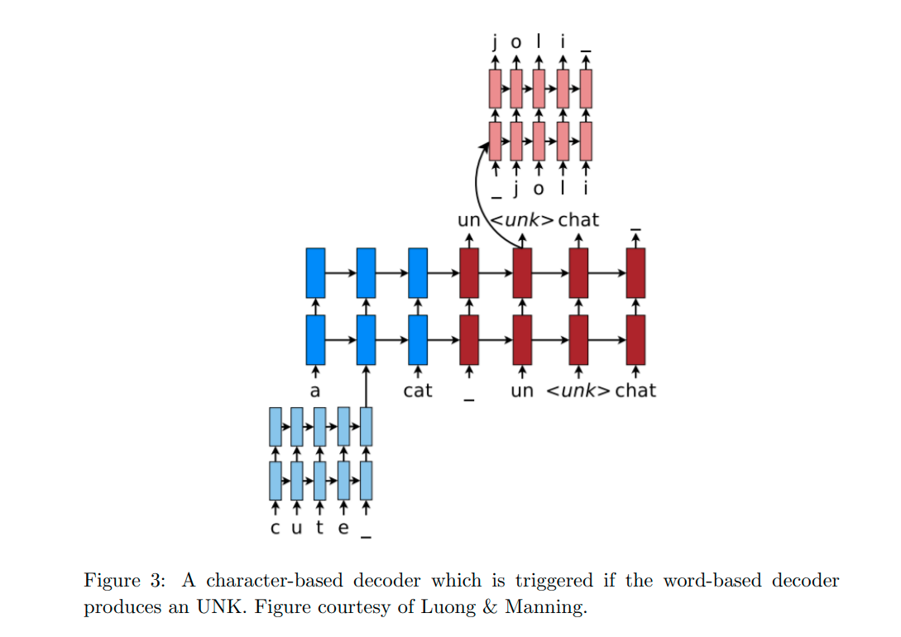

# NMT system with sub-word modelling and CNN-based embeddings


This repository contains implementation of sequence-to-sequence model with attention for Neural Machine Translation
 task. In Machine Translation, our goal is to convert a sentence from the source language (e.g. Spanish) to the
target language (e.g. English)
 
 The implementation is part of assignment #5 for Stanford's CS224n: Natural Language Processing with Deep Learning.

Assignment handout:
 https://web.stanford.edu/class/archive/cs/cs224n/cs224n.1194/assignments/a5.pdf

---
Most work is concentrated in:
 
 * `highway.py` - Highway network for the encoder.
 * `cnn.py` - Convolution network for the encoder.
 * `vocab.py` - Vocabulary class, taking care of tokenization and pre-processing.
 * `model_embeddings.py` - torch.Module sub-class responsible for producing CNN-based embeddings. Training code isn't contained here.
 *  `nmt_model.py` - implements the entire encoder-decoder architecture.
 * `char_decoder.py` - implements character decoder.
 

 See implementation requirements in handout/a5.pdf

## Installation and training

1) Create a new conda environment: ```conda env create --file local_env.yml```
2) Generate vocabulary: ```sh run.sh vocab```
3) If training on GPU, install 
4) Training

#### For local development (trained on CPU) 
```sh run.sh train_local_q2```

```sh run.sh test_local_q2```

#### For training on GPU:

Install additional packages:

```pip install -r gpu_requirements.txt```

Run training:

```sh run.sh train```

## Encoder Architecture

Consists of the following steps:
* Converting word to char indices
* Padding and embedding lookup
* Convolutional network, summarising results using max-pooling.
* Highway layer and dropout - providing skip-connection controlled by a dynamic gate (learned parameter)


 
 ## Decoder Architecture
 
 Consists of the following steps:
 * Forward computation of Character Decoder
 * Training of Character Decoder.
 * Decoding from the Character Decoder
 
 

 
